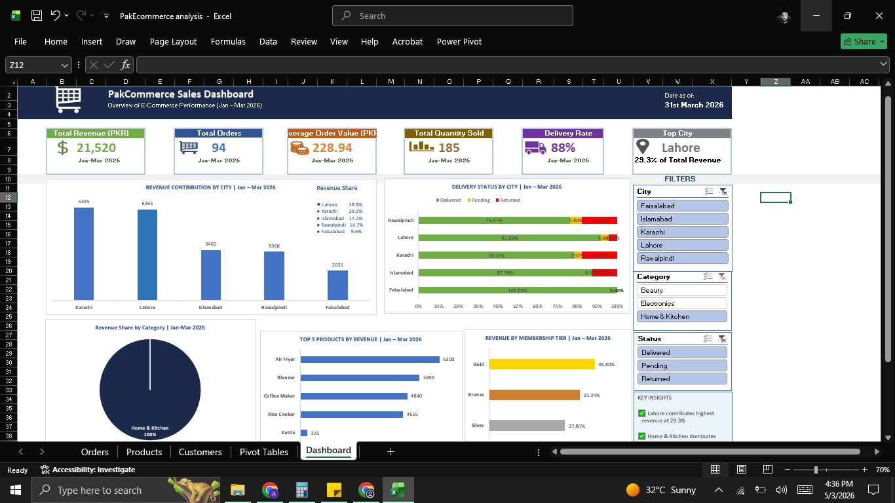

# PakCommerce Sales Dashboard 📊

## Overview
An interactive E-Commerce Sales Dashboard built entirely in Microsoft Excel, 
analyzing 300 orders across 5 Pakistani cities for Q1 2026.

## Dashboard Features
- 6 Dynamic KPI Cards — Total Revenue, Orders, Avg Order Value, 
  Quantity Sold, Delivery Rate and Top City
- 5 Interactive Charts — Revenue by City, Delivery Status, 
  Category Share, Top 5 Products and Membership Tier
- 3 Slicers — Filter by City, Category and Order Status
- All KPIs and charts update instantly when filters are applied
- Key Insights box with real business findings
- Professional footer with tools and color guide

## Key Business Insights Discovered
- Lahore generates highest revenue at 29.3% of total
- Home & Kitchen dominates at 57% of all revenue
- 88% of orders delivered successfully
- Islamabad has highest return rate at 13.33%
- Faisalabad has 0% return rate — highest customer satisfaction
- Gold members drive 35.66% of total revenue

## Tools & Techniques Used
- Pivot Tables and Pivot Charts
- VLOOKUP and XLOOKUP across 3 data tables
- SUMIF, COUNTIF, MAXIFS for calculations
- INDEX MATCH for dynamic KPIs
- Slicers connected to all charts simultaneously
- IFERROR for error handling
- Dashboard design and conditional formatting

## Dataset
- 300 orders across 3 related tables
- Orders table — 300 rows, 14 columns
- Products table — 15 products across 3 categories
- Customers table — 50 customers across 5 cities

## Skills Demonstrated
- Data Cleaning — duplicates, blanks, negatives, inconsistencies
- Data Modeling — connecting multiple tables
- Data Analysis — business insights from raw data
- Data Visualization — professional dashboard design
- Business Communication — insights presented for decision making

## Project Structure
- Orders Sheet — Raw connected data
- Products Sheet — Product catalog
- Customers Sheet — Customer information
- Pivot Tables Sheet — Analysis calculations
- Charts Sheet — Individual chart storage
- Dashboard Sheet — Final interactive dashboard

## Connect With Me
- LinkedIn: https://www.linkedin.com/in/ali-zaib-6aa913388
- Learning Path: Excel → SQL → Python → Tableau/Power BI

 
